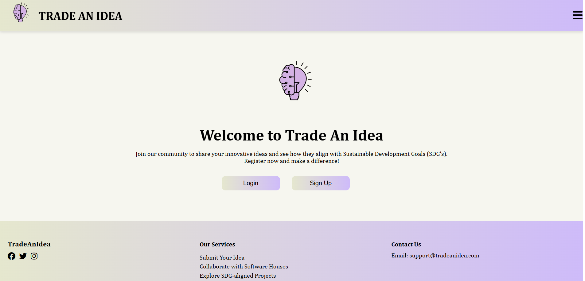

# Trade an Idea

Trade an Idea is a platform where users can share and discuss innovative ideas. The platform features authentication with OTP verification, categorized idea submissions, and AI-powered originality checks.

## Screenshots


## Features
- **Authentication with OTP** for secure login.
- Users can **view and add comments** on ideas.
- Users can **post their own ideas** and categorize them based on **SDGs (Sustainable Development Goals)**.
- **AI-powered originality check** before submitting an idea.
- Users can **view their profile** and manage their contributions.

## Tech Stack
### Frontend
- **React.js**
- **CSS**

### Backend
- **Node.js**
- **Express.js**
- **MySQL**

### AI Model
- **Fine-tuned `ahxt/LiteLlama-460M-1T` model** from Hugging Face
- **Trained using TensorFlow and PyTorch**
- **Deployed via ngrok**
- **Custom dataset created using Faker**

## AI Model Functionality
- The model acts as a **judge for project ideas**, checking feasibility based on past occurrences.
- If an idea has **70% or higher plagiarism**, it is **rejected**; otherwise, it is **accepted**.
- The model is trained on **custom dataset** generated with Faker.

## Installation & Setup
1. Clone the repository:
   ```bash
   git clone https://github.com/your-username/trade-an-idea.git
   cd trade-an-idea
   ```

2. Install dependencies for the backend:
   ```bash
   cd backend
   npm install
   ```

3. Set up the MySQL database and configure `.env` file with database credentials.

4. Start the backend server:
   ```bash
   npm start
   ```

5. Install dependencies for the frontend:
   ```bash
   cd ../frontend
   npm install
   ```

6. Start the frontend server:
   ```bash
   npm start
   ```

7. Set up and deploy the AI model using ngrok.

## Contributing
Feel free to contribute by submitting issues or creating pull requests.

## For Queries
```Email
hjamshaid81@gmail.com

